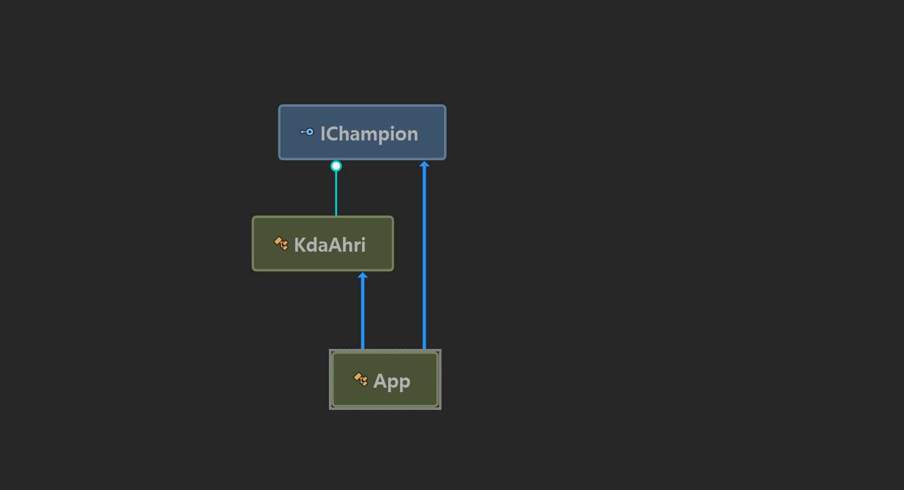
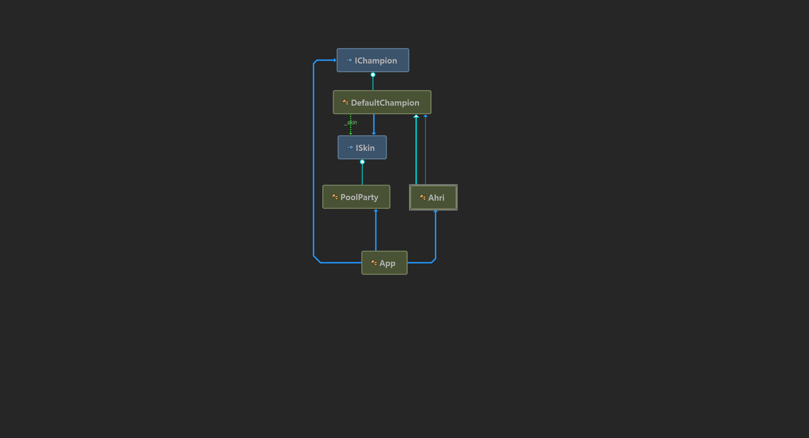

## Bridge Pattern
- To composite with abstraction and concrete implementation

- 구체적인 구현 사이에 추상적인 클래스를 (브릿지로) 두는 것

## Class Diagram
### Before

### After

## Addtional reading 

https://docs.microsoft.com/ko-kr/dotnet/csharp/language-reference/keywords/base