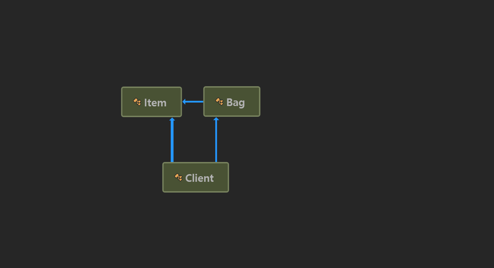
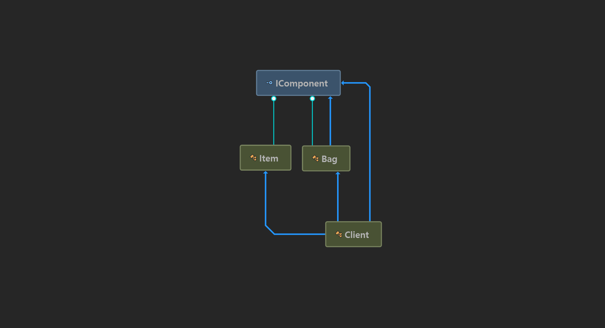

### Composite Pattern
the patterns that can objects the same as the categories of the objects

For example, here, items as objects, bag as catgegories and both as Component

**caution**

beware of exceesive generalization.

Sometimes, because of generalization, we should add a type verification in code.

### Class Diagram

- Before

- After
